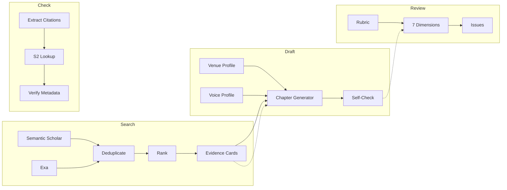

# Research Toolkit

> A modular AI toolkit for academic research workflows — search, draft, review, verify.

[](LICENSE)
[](https://python.org)
[](#status)

---

## What Is This?

Research Toolkit breaks academic research workflows into four independent **skills** — small, focused tools that each handle one step of the process. Use them individually or chain them into a pipeline.

Think of it like Unix pipes for research: each skill does one thing well, takes structured input, and produces structured output.

### The Four Skills

| Skill | What it does | Command |
|-------|-------------|---------|
| **Search** | Finds relevant papers across databases, removes duplicates, ranks by relevance, and extracts key findings into structured "evidence cards" | `research-toolkit search "your topic"` |
| **Draft** | Generates a first draft that follows the formatting rules of your target publication (e.g., conference paper, policy brief, literature review) | `research-toolkit draft "topic" --venue conference_paper` |
| **Review** | Evaluates a draft across 7 quality dimensions (structure, clarity, sources, argumentation, ...) and reports issues by severity | `research-toolkit review paper.md` |
| **Check** | Extracts citations from a document and verifies them against Semantic Scholar — catches wrong years, wrong authors, non-existent papers | `research-toolkit check paper.md` |

### Key Concepts

**Venue profiles** = publication format templates. A "venue" is where you want to publish — a conference, a journal, a policy report. Each venue profile defines: page limits, required sections, citation style, and review criteria. The toolkit ships with 8 profiles, and you can create your own by copying a JSON file.

**Voice profiles** = writing style templates. They define: sentence length, typical phrases, formality level, things to do and avoid. Currently two voices: formal academic English and formal academic German.

**Evidence cards** = structured paper summaries. Instead of dumping full paper text into downstream tools (expensive, noisy), the Search skill compresses each paper into a JSON card with: the main claim, method used, key metrics, limitations, and a confidence level. Evidence cards are **pointers, not substitutes** — they accelerate your reading path but do not replace engaging with primary sources. Before citing a paper based on its evidence card, verify the claim against the original.

## Status

> **Working Prototype.** This toolkit demonstrates what's achievable with AI-assisted development in a short timeframe. The architecture and data models are solid (207 tests passing), but individual skills have not been fine-tuned for production quality. The Draft and Review skills require an LLM backend (not included) to generate actual text — the toolkit provides structure, prompts, and quality checks. There is significant room for improvement in search coverage, ranking algorithms, voice calibration, and citation extraction accuracy.

## Quickstart

```bash
# 1. Clone and install
git clone https://github.com/smarqart-hash/research-toolkit.git
cd research-toolkit
pip install -e ".[dev]"

# 2. Run setup wizard — walks you through API keys, preferred format, and language
python setup.py

# 3. Search for papers on a topic
research-toolkit search "AI transparency in automated decision-making"
```

## Architecture



Every action is logged to an append-only provenance file (JSONL), creating a full audit trail from source paper to output claim.

## Skills in Detail

Each skill has a detailed instruction file in `skills/` that you can load into any AI coding assistant (Claude Code, Cursor, Windsurf, Copilot, aider, etc.). These files contain the full workflow, prompts, and quality checks for each skill.

### Search

Queries Semantic Scholar (and optionally Exa) with multiple search terms, deduplicates by DOI/title, ranks by citation count + recency, and extracts evidence cards.

```bash
research-toolkit search "federated learning privacy" --max 50 --years 2022-2026
```

**Evidence Card example:**
```json
{
  "claim": "Detailed technical AI explanations reduce public trust by 18%",
  "method": "3 RCTs, N=2400, between-subjects",
  "metrics": {"p_value": 0.003, "effect_size": 0.34},
  "limitations": ["US-based sample only", "Hypothetical scenarios"],
  "confidence": "high"
}
```

### Draft

Loads a venue profile (publication format) and a voice profile (writing style), then generates a chapter structure with prompts. Includes a self-check that flags structural gaps.

```bash
research-toolkit draft "AI ethics" --venue conference_paper --voice academic_en
```

> **Note:** Actual text generation requires an LLM backend (not included). The toolkit provides the structure, constraints, and quality checks — you bring the language model.

### Review

Evaluates a document across quality dimensions defined in rubrics. Uses ordinal labels (strong / adequate / needs work / critical) instead of numeric scores. Each issue gets a severity level (CRITICAL, HIGH, MEDIUM, LOW) and a concrete suggestion.

```bash
research-toolkit review paper.md --venue literature_review
```

### Check

Extracts Harvard-style citations from a document, looks up each one in Semantic Scholar, and reports: verified, not found, or metadata mismatch.

```bash
research-toolkit check paper.md
```

## Venue Profiles (Publication Formats)

List all available formats: `research-toolkit venues`

| Profile | Type | Pages | Citation Style |
|---------|------|-------|---------------|
| `working_paper` | Preprint | 15-30 | APA |
| `conference_paper` | Conference | 8-12 | Numeric |
| `literature_review` | Review | 20-40 | APA |
| `policy_brief` | Policy | 10-20 | Footnote |
| `research_report` | Report | 30-80 | APA |
| `position_paper` | Opinion | 5-15 | APA |
| `arxiv_cs_ai` | Preprint | — | Numeric |
| `nature_communications` | Journal | ~5000w | Nature |

**Create your own:** Copy any JSON file from `config/venue_profiles/`, rename it, and adjust the fields. A venue profile is ~20 lines of JSON.

## Voice Profiles (Writing Styles)

| Profile | Language | Style |
|---------|----------|-------|
| `academic_en` | English | Formal, hedged, evidence-driven |
| `academic_de` | German | Formal-akademisch, sachlich-distanziert |

**Create your own:** Copy a JSON file from `config/voice_profiles/`. The profile defines sentence length, typical phrases, tone, dos/donts, and structural patterns.

## Recommended Models

The toolkit is LLM-agnostic — it provides structure and data, you bring the language model. Here's what works well:

| Task | Recommended | Budget Alternative |
|------|------------|-------------------|
| **Search** (clustering, evidence extraction) | Claude Sonnet, GPT-4o | Claude Haiku, GPT-4o-mini |
| **Draft** (writing chapters) | Claude Opus/Sonnet, GPT-4 | — (quality matters here) |
| **Review** (evaluating quality) | Claude Opus/Sonnet, GPT-4 | Claude Sonnet for structural checks |
| **Check** (citation verification) | Any model (mostly API calls) | Claude Haiku, GPT-4o-mini |

The toolkit works with any model that can follow structured instructions. The skills in `skills/` contain the prompts and workflows — load them into your preferred AI assistant.

## API Setup

| API | Required? | Free Tier | Where to get a key |
|-----|-----------|-----------|-------------------|
| **Semantic Scholar** | Recommended | Yes — works without key (slower) | [semanticscholar.org/product/api](https://www.semanticscholar.org/product/api) |
| **Exa** | Optional | 1000 requests/month | [exa.ai](https://exa.ai) |

The setup wizard (`python setup.py`) guides you through API key configuration.

### Getting Your API Keys

**Semantic Scholar** (recommended, free):
1. Go to [semanticscholar.org/product/api](https://www.semanticscholar.org/product/api)
2. Click "Request API Key" — approval is usually instant
3. Without a key, the API still works but with shared rate limits (expect 429 errors under load)
4. With a key: 100 requests/second, access to all endpoints

**Exa** (optional, extends coverage):
1. Sign up at [exa.ai](https://exa.ai)
2. Free tier: 1000 searches/month
3. Exa uses neural search — finds papers that keyword search misses
4. Without Exa: Search uses only Semantic Scholar (still effective for most topics)

## Example Output

See [`examples/ai_automated_research/`](examples/ai_automated_research/) for a complete pipeline run on "AI-Assisted Automated Research" — including real Semantic Scholar search results, evidence cards, a literature review draft, structured review feedback, and citation verification.

This example is meta: it uses the toolkit to research the field of automated research tools.

## Known Limitations

| Skill | Limitation | Impact |
|-------|-----------|--------|
| **Search** | Semantic Scholar only (English-dominant). Non-Anglophone literature, grey literature, and databases like LIVIVO/BASE/PubMed not covered. | Systematic bias toward English-language publications. Supplement with domain-specific databases for comprehensive reviews. |
| **Search** | Ranking uses citation count + recency composite. Not validated against domain-specific ground truth. | May surface popular papers over methodologically strongest ones. |
| **Draft** | Voice calibration not fine-tuned. Self-check does not detect circular argumentation or logical fallacies. | Outputs require expert review before any submission. |
| **Review** | Confidence labels in evidence cards are categorical ("high/medium/low"), not calibrated probabilities. | Labels should be read as heuristic indicators, not quantitative assessments. |
| **Check** | Citation extraction uses regex for Harvard-style references. Other citation formats may be missed. | Run Check as a safety net, not as sole verification. |
| **Pipeline** | Provenance trail covers toolkit actions but not the external LLM interaction ("bring your own"). | The LLM step is outside the audit trail — document model and version separately. |

## Responsible Use

- **Check is not optional.** Any AI-generated content will contain errors. Run the Check skill before using AI-drafted text. This is the minimum verification step.
- **Evidence cards are pointers.** Before including any claim from an evidence card in a manuscript, verify it against the primary source. The toolkit accelerates your reading path — it does not replace reading.
- **Document your AI use.** The provenance JSONL trail covers the toolkit's actions. For the LLM step, record which model, version, and prompts you used. Consider [PRISMA-trAIce](https://pmc.ncbi.nlm.nih.gov/articles/PMC12694947/) for systematic reviews.
- **Supplement the search.** Semantic Scholar is English-dominant. For comprehensive reviews, add domain-specific databases (PubMed, LIVIVO, Scopus) manually.

## What This Is Not

- **Not a paper generator.** It structures, searches, and checks — the thinking is yours.
- **Not production-ready.** It's a working prototype that demonstrates the architecture.
- **Not a replacement for reading papers.** Evidence cards are summaries, not substitutes.
- **Not tied to one AI tool.** The skill instructions work with any LLM. Claude Code, Cursor, Windsurf — pick your tool.

## Tech Stack

- **Python 3.11+** — pydantic, httpx, rich, typer
- **Semantic Scholar API** — paper search and metadata
- **Exa API** — complementary neural search
- **Provenance tracking** — append-only JSONL audit trail

### Optional Dependencies

```bash
pip install -e ".[nlp]"         # sentence-transformers for local ranking
pip install -e ".[parsing]"     # PDF parsing (PyMuPDF — AGPL-3.0 licensed)
pip install -e ".[typesetting]" # Pandoc for .docx export
```

> **License note:** The `[parsing]` extra includes PyMuPDF (AGPL-3.0). If AGPL is incompatible with your use case, use `pypdf` or `pdfplumber` (MIT) as alternatives.

## License

[Apache License 2.0](LICENSE)

This toolkit uses the [Semantic Scholar API](https://www.semanticscholar.org/product/api) by the Allen Institute for AI.

---

Built by [Stefan Marquart](https://github.com/smarqart-hash)